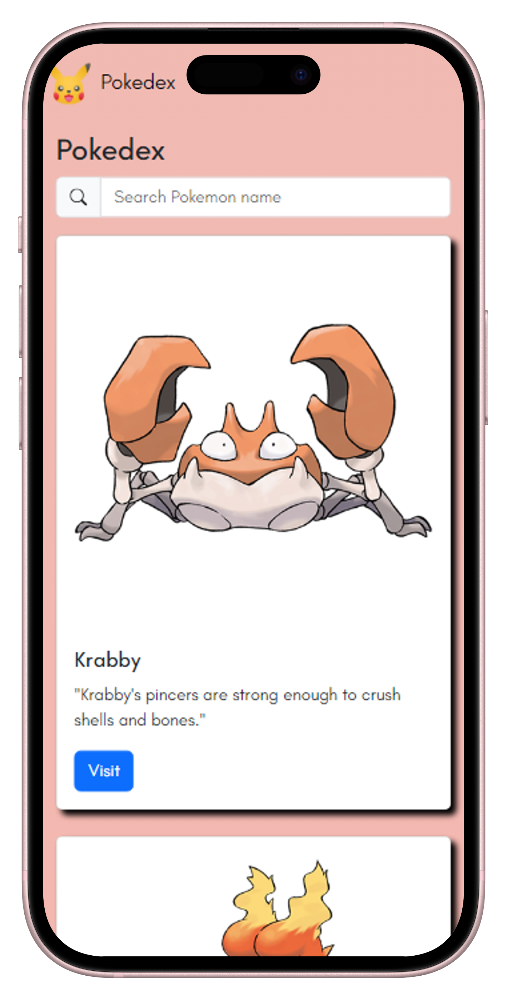

# Pokedex

A Web Application that renders Pokemon that in fetches from data.json
 
## Preview

| width=100
| width=100

## Features

- **Fuzzy Search**: Filters out pokemon on close search match. Implemented using [`fuse.js`](https://www.fusejs.io/)
- **Performance**: Debouncing the input for filtering. Code and file compression using Parcel's built-in deploy build
- **Accessibility**: Using / (_slash_) to activate the input field and using tabs to navigate the cards
- **Type-safety**: Implemented types for robust code adding `Interfaces` for custom types
- **Better UX**: Random shuffling of pokemon on every render. Implemented using [array-shuffle](https://www.npmjs.com/package/array-shuffle)
